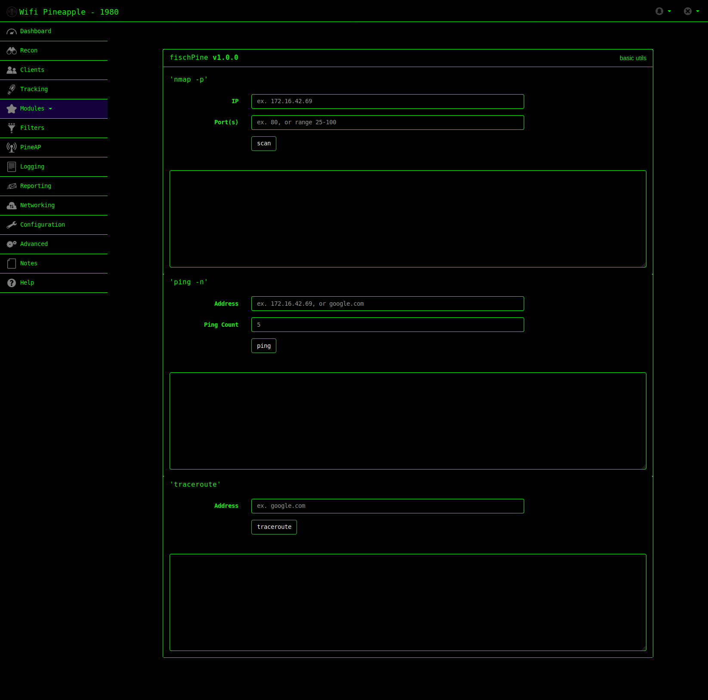

# fischPine
A simple WiFi Pineapple module that does simple things. Mostly cannibalized from the other available pineapple [modules](https://github.com/hak5/wifipineapple-modules). More to be implemented in the future but here's a start.

## Features
1. nmap port scanning
2. ping testing
3. traceroute mapping 

## Install
Clone or download this repo and copy the `fischPine/` folder to your WiFi Pineapple's `/pineapple/modules/` directory.

# Screenshot

